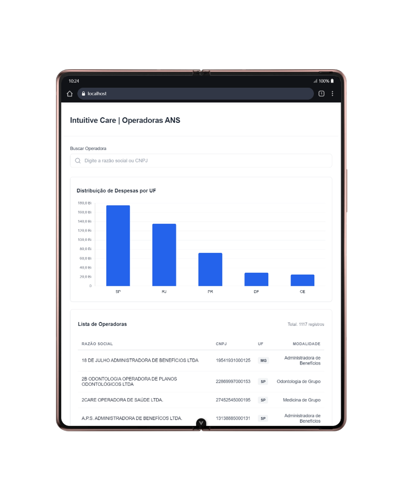
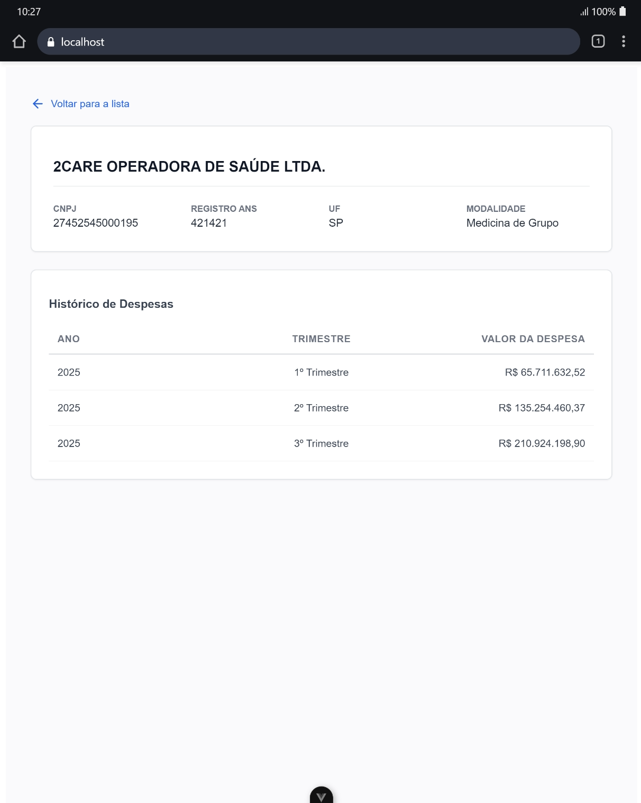

# Teste Técnico - Intuitive Care

Este projeto implementa um pipeline de dados para coleta, processamento e consolidação das Demonstrações Contábeis disponibilizadas pela ANS (Agência Nacional de Saúde Suplementar).

O objetivo é automatizar o acesso aos dados públicos da ANS, processar e consolidar as Demonstrações Contábeis dos últimos trimestres disponíveis, aplicando regras de negócio contábeis e gerando arquivos estruturados para análise posterior.

## Estrutura do Projeto

- **`ingestion/`** Scripts responsáveis pelo web scraping no site da ANS e download automatizado dos arquivos ZIP.

- **`processing/`** Scripts de ETL (Extração, Transformação e Carga). Realizam a descompactação, filtragem contábil ("Despesas com Eventos/Sinistros") e consolidação dos dados.
  - `data_processor.py`: Limpeza e consolidação.
  - `data_enrichment.py`: Enriquecimento com dados cadastrais e geração de estatísticas.

- **`sql/`** Scripts SQL para criação do banco de dados e consultas analíticas.
  - `create_tables.sql`: Estrutura das tabelas (DDL).
  - `analytical_queries.sql`: Respostas para as perguntas de negócio (DML).

- **`backend/`** API REST desenvolvida com FastAPI para expor os dados processados.
  - `main.py`: Definição das rotas e inicialização do servidor.
  - `database.py`: Configuração da conexão com o banco de dados.
  - `models.py`: Modelagem das tabelas (SQLAlchemy).

- **`frontend/`** Interface Web desenvolvida com Vue.js para visualização dos dados.
  - `src/views/`: Telas da aplicação (Dashboard e Detalhes).
  - `src/components/`: Componentes reutilizáveis (Tabelas e Gráficos).

- **`data/`**
  - **`raw/`**: Armazena os arquivos ZIP brutos baixados (ignorado pelo Git).
  - **`processed/`**: Armazena os CSVs extraídos e os arquivos finais (`consolidado_despesas.csv`, `despesas_agregadas.csv` e `.zip`).

- **`docs/`** Documentação das decisões técnicas e trade-offs adotados no projeto. Também contém a collection do Postman (`api_collection.json`).

- **`main.py`**
  Script orquestrador que executa o pipeline completo (Ingestão + Processamento + Geração de SQL).

- **`db_importer.py`**
  Script utilitário que lê os CSVs processados e gera o arquivo `inserts.sql` para carga no banco de dados.

## Pré-requisitos

- Python 3.10 ou superior
- Node.js 18 ou superior (Para o Frontend)
- Gerenciador de pacotes `pip` e `npm`
- Banco de Dados PostgreSQL (Recomendado para etapa de SQL e API)

## Decisões Técnicas e Trade-offs

Todas as decisões de arquitetura, escolhas de bibliotecas (como o uso de FastAPI e Vue.js), estratégias de banco de dados e justificativas para o tratamento de inconsistências nos dados estão detalhadas no documento específico:

**[Ler Documentação de Trade-offs](docs/tradeoffs.md)**

## Como usar este projeto

Passo a passo para rodar o projeto localmente.

### 1. Configuração Inicial
Prepare o ambiente Python e as variáveis de conexão.

* Instale as dependências:
    ```bash
    pip install -r requirements.txt
    ```
* Configure o acesso ao banco:
    * Crie um arquivo `.env` na raiz (use o `.env.example` como base).
    * Ajuste a `DATABASE_URL` com suas credenciais do PostgreSQL local.

### 2. Pipeline de Dados ETL
Execute o script principal para baixar os dados da ANS, tratar as inconsistências e gerar os arquivos consolidados.

* Na raiz do projeto:
    ```bash
    python main.py
    ```
    *Isso vai criar os arquivos CSV na pasta `data/processed/`.*

### 3. Banco de Dados
Com os arquivos gerados, crie a estrutura no banco e realize a carga.

* Certifique-se que o banco configurado no `.env` existe.
* Execute o script de criação das tabelas no seu gerenciador (pgAdmin/DBeaver):
    * `sql/create_tables.sql`
* Rode o script de importação automática:
    ```bash
    python db_importer.py
    ```

### 4. Execução da API
Suba o servidor FastAPI para expor os dados.

* Inicie o backend:
    ```bash
    uvicorn backend.main:app --reload
    ```
    *API disponível em: `http://127.0.0.1:8000`*
    *Swagger (Documentação): `http://127.0.0.1:8000/docs`*

### 5. Interface Web
Inicie o frontend para realizar buscas, visualizar indicadores por UF e consultar o histórico de despesas detalhado.

* Em um novo terminal, entre na pasta e instale as dependências:
    ```bash
    cd frontend
    npm install
    ```
* Rode a aplicação:
    ```bash
    npm run dev
    ```
    *Acesse pelo navegador em: `http://localhost:5173`*

### 6. Testes Manuais
Para validar os endpoints isoladamente:

* Importe o arquivo `docs/api_collection.json` no **Postman**.
* Utilize as requisições prontas para testar listagem, busca e estatísticas.


## Prévia da Aplicação

### Dashboard Principal
Visualização consolidada com busca, listagem paginada e gráfico de distribuição por UF.



### Detalhes da Operadora
Visão detalhada com dados cadastrais e histórico financeiro trimestral.



*(Screenshots demonstrativos da interface desenvolvida com Vue.js)*


## Autor

João Vitor Alcântara da Silva